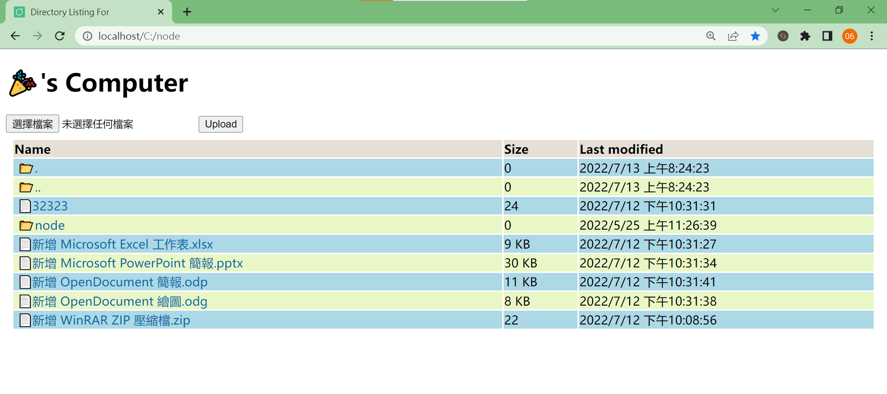
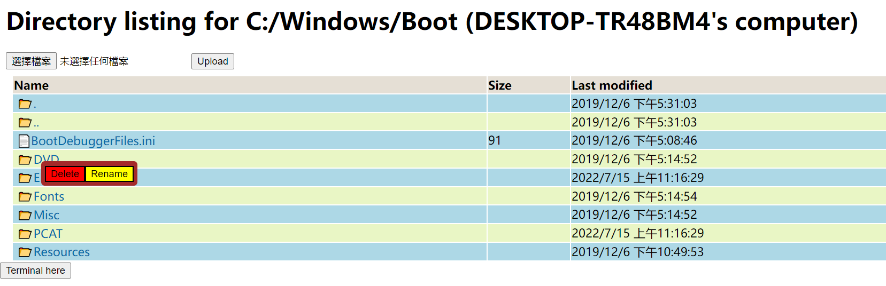
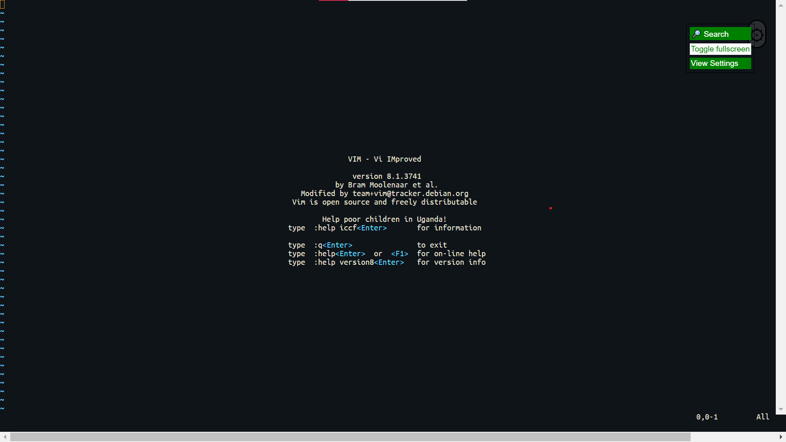
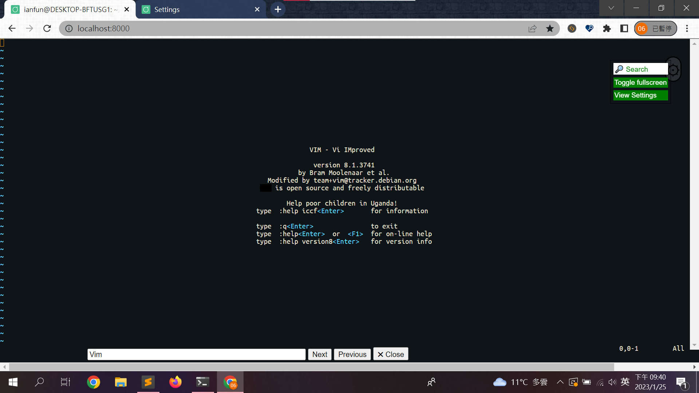
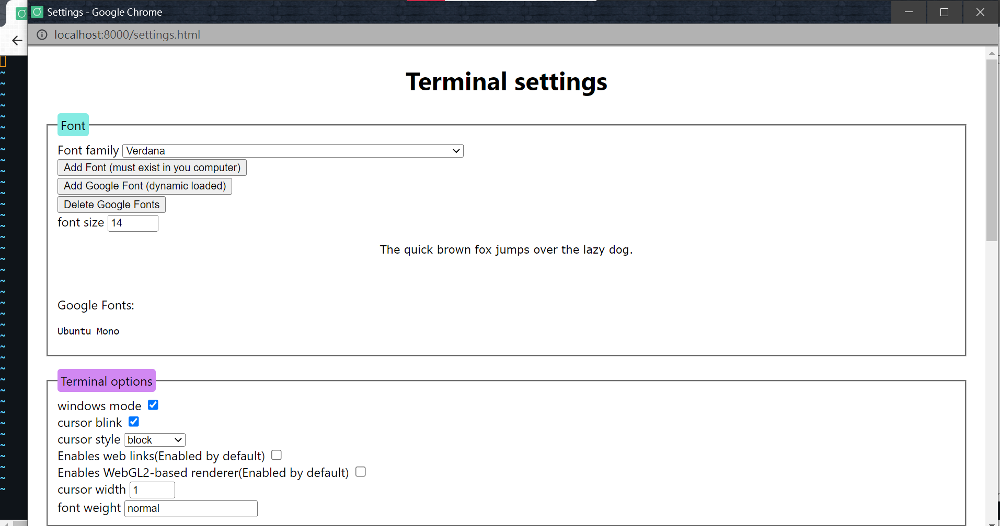
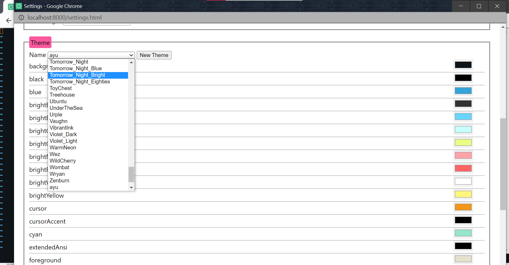

# Web-Terminal-File-manager

Manage your files and terminal in your browser.

* Secure warning: Supports HTTP only, HTTPS/WSS is not supported.
* Supports Windows 10+, Linux (Linux kernel 5+).

## Screenshots








## Usage

* Terminal: http://localhost/
* Settings: http://localhost/settings.html

Otherwise, fallback to static files.

## Manage service in windows

In windows, the server can run as a windows service.
It's name is `httpserver`, you can manage it with `sc` command.

```bash
$ sc start httpserver
$ sc query httpserver
$ sc stop httpserver
```

When you install the server installer, you can choose run as system account or login your accout(requires password).The shell will login with that account.This is important for launch Windows Subsystem Linux (WSL)'s shell.

## Install

See Release page.

