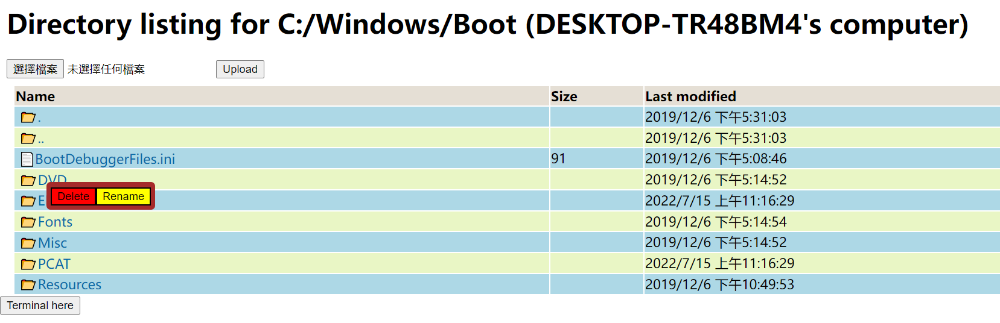

# Win32-static-file-Server

File Server &amp; Websocket Terminal in C++(Win32 API)

Dependency: <https://github.com/nodejs/llhttp>

## Screenshots


## Apps

* console app: used for debugging, press Ctrl+C to stop.
* service app: a windows service, can login to user account or use `nt authority/system` account.

## Why this is useful

once you install the service app, you can use `sc` to management **httpserver** service.

```bash
cmd> sc start httpserver
cmd> sc query httpserver
cmd> sc stop httpserver
```

by default, it use <http://localhost> for default url, and the directory where it installed is static file path.

by default, directory listing is enabled, and you can delete file/create file/create folder/delete folder recursively, and launch a terminal in the directory.


